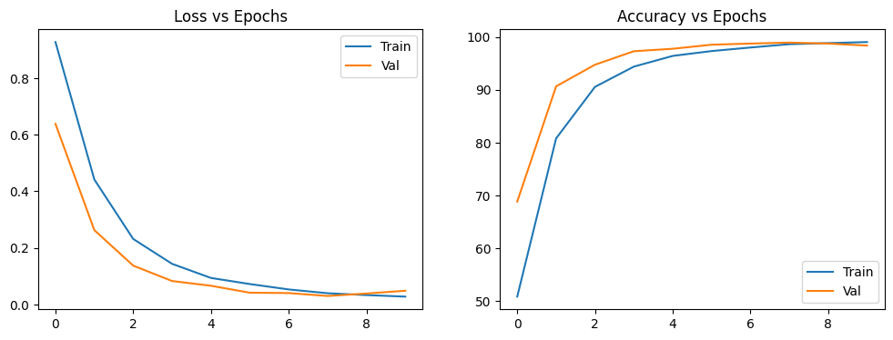
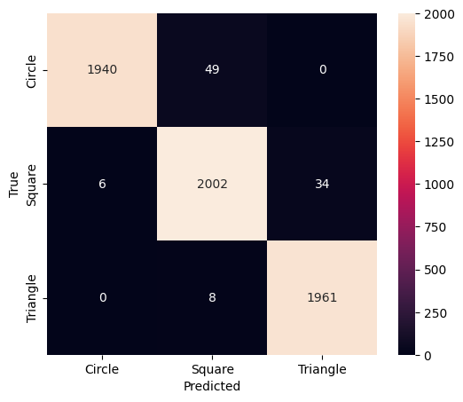
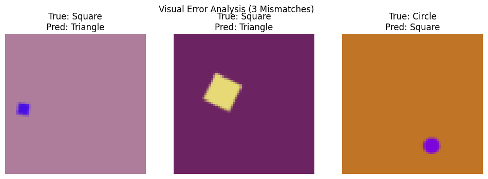

# Geometric Shape Classification using CNN (PyTorch)

**Student ID:** 200109   
**Course Assignment:** CNN Image Classification  

## Project Overview
This project implements a Convolutional Neural Network (CNN) to classify geometric shapes (Circles, Squares, and Triangles). The model is trained on a standard dataset and validated using real-world photos taken with a smartphone.

---

## Training Results

### Accuracy & Loss Plot
The model was trained for 10 epochs. Below is the training and validation history showing the convergence of loss and accuracy.

### Confusion Matrix
The heatmap below shows the model's performance on the test set, highlighting how well it distinguishes between the three classes.

---

## Real-World Testing (Custom Dataset)

### Custom Prediction Gallery
The following grid shows 10 photos taken with a smartphone. The model predicts the shape and provides a confidence percentage.

### Visual Error Analysis
To understand where the model struggles, here are 3 instances where the model misclassified a shape from the test set.

---

## How to Run
1. Open the `200109.ipynb` file in Google Colab.
2. Click **Runtime > Run All**.
3. The notebook will automatically clone this repository, load the dataset, and run the predictions.
